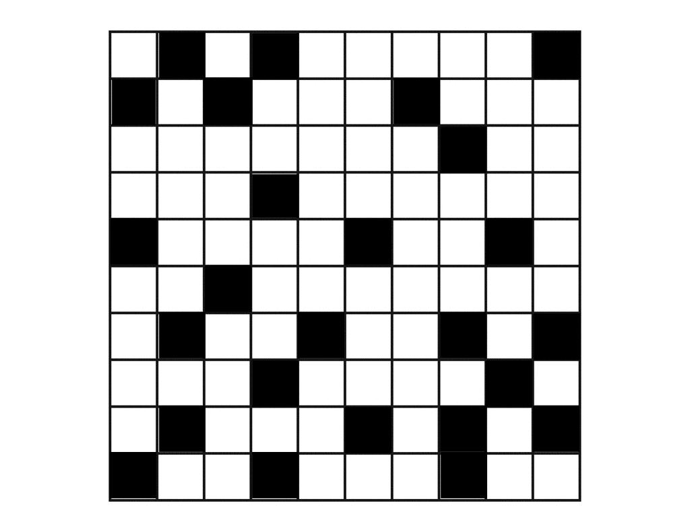
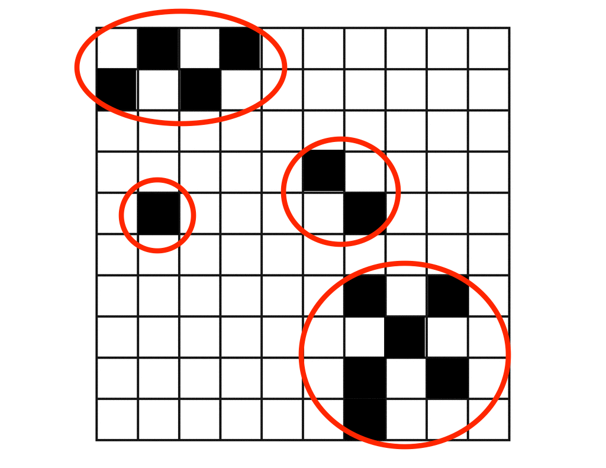

#Experiment on Human Pattern Recognition

##Overview
Pattern recognition is a central problem in artificial intelligence. It enables agents to build a sense of the world with a lot of information. There are many problems in this field, for example,  the feature selection.

This experiment is aimed to show some property of the human vision process in order to give some idea of how human brain processes features.

##Experiment
The experiment is very simple. Volunteers are asked to watch a pattern in a 10 by 10 grid for 20 seconds and then draw the same thing to a blank grid.

The original patten is below:

It's a little bit mess in some sense. The upper-left corner and the lower-right corner has a regular pattern each, and other parts of the picture is mess. More over, the pattern in lower-right corner is "more regular" than the one in the upper-left corner in some sense. That is a test of the priority order of "regular" and position in human brain.

##Results of the Experiment
This one is by the first volunteer.

The red circles represent blocks when the picture is drawn. The upper-left one is the first to be drawn to the grid. It matches the original one perfectly. She then draw the one in the lower-right corner, which is translated by one square. The third one to be drawn is the one with two squares inside between the precious two. It is also translated. The last one seems doesn't match the original picture at all.

This picture gives some pieces of information:
1. Regular Patterns are processed much better than irregular ones
2. Patterns in human vision are highly abstract and translation-invarient.
3. The irregular patterns are only marked as "irregular" at first, they are not memorized at all.

The second volunteer draws as below:
